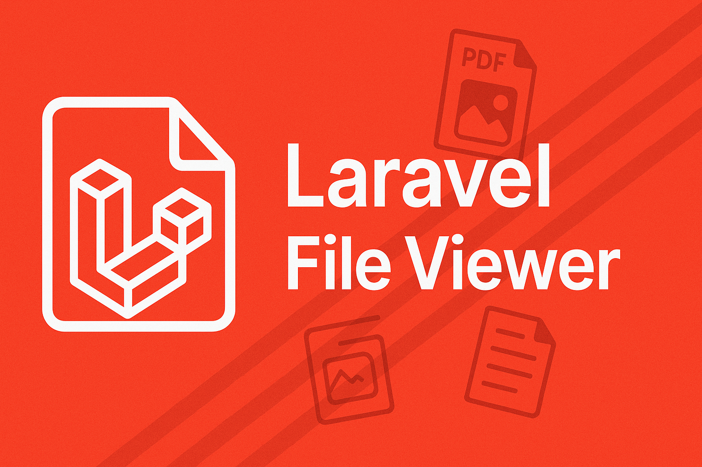

# 🖼️ Laravel File Viewer
[](https://packagist.org/packages/vish4395/laravel-file-viewer)
[](https://packagist.org/packages/vish4395/laravel-file-viewer)

[](https://github.com/vish4395/laravel-file-viewer/stargazers)
[](https://twitter.com/intent/tweet?text=Checkout%20this%20awesome%20package%0Ahttps%3A//github.com/vish4395/laravel-file-viewer/)

<p align="center">

</p>

**Laravel File Viewer** is the easiest way to preview images, videos, audio, PDF, DOCX, PPTX, XLSX, and more in your Laravel app. Instantly add beautiful file previews to your admin panels, dashboards, or user portals.

---

> **✨ Loved by developers. Easy to install. Works out of the box.**

---

## 🚦 Features

- 📄 Preview images, videos, audio, PDF, DOCX, PPTX, XLSX, and more
- ⚡️ Super simple integration—just one line in your controller!
- 🎨 Customizable UI (publish and tweak the views)
- 🛡️ Secure: works with Laravel's storage disks
- 🌍 Multilingual ready

---

## 🛠️ Installation

Install via Composer:

```bash
composer require vish4395/laravel-file-viewer
```

Publish assets:

```bash
php artisan vendor:publish --provider="Vish4395\LaravelFileViewer\LaravelFileViewerServiceProvider" --tag=assets
```

Publish views (optional, for UI customization):

```bash
php artisan vendor:publish --provider="Vish4395\LaravelFileViewer\LaravelFileViewerServiceProvider" --tag=views
```

---

## 🚀 Quick Start

Add the alias in your `config/app.php` (Laravel 10 and below):

```php
'aliases' => Facade::defaultAliases()->merge([
    'LaravelFileViewer' => Vish4395\LaravelFileViewer\LaravelFileViewerFacade::class,
])->toArray(),
```

### Example Controller

```php
use Illuminate\Http\Request;
use Vish4395\LaravelFileViewer\LaravelFileViewer;

class FilePreviewController extends Controller
{
    public function filePreview($fileName){
        $filePath = $fileName;
        $disk = 'public';
        $fileUrl = asset('storage/' . $fileName);
        $fileData = [
            [
                'label' => __('Label'),
                'value' => "Value"
            ]
        ];
        return LaravelFileViewer::show($fileName, $filePath, $fileUrl, $disk, $fileData);
    }
}
```

Add a route in `routes/web.php`:

```php
Route::get('/file-preview/{fileName}', [FilePreviewController::class, 'filePreview']);
```

---

## 🌟 Why Laravel File Viewer?

- **Save hours**: No need to integrate multiple JS libraries yourself.
- **Modern UI**: Looks great out of the box.
- **Flexible**: Works with any Laravel storage disk.
- **Trusted**: Used in production by agencies and startups.

---

## 📈 Help Us Grow!

If you find this package useful:

- ⭐ Star this repo on GitHub
- 📦 Try it in your next Laravel project
- 🐦 Tweet about it [@vish4395](https://twitter.com/vish4395)
- 💬 Share feedback and suggestions

---

## 📋 Changelog

See [CHANGELOG](CHANGELOG.md) for recent updates.

---

## 🤝 Contributing

PRs are welcome!
See [CONTRIBUTING](CONTRIBUTING.md) for details.
Questions? Email [vishal@newai.in](mailto:vishal@newai.in) or open an issue.

---

## 🔒 Security

If you discover any security issues, please email [vishal@newai.in](mailto:vishal@newai.in) instead of using the issue tracker.

---

## 👏 Credits

- [Vishal Sharma](https://github.com/vish4395)
- [meshesha/officetohtml](https://github.com/meshesha/officetohtml)
- [VolodymyrBaydalka/docxjs](https://github.com/VolodymyrBaydalka/docxjs)
- [All Contributors](../../contributors)

---

## 📄 License

MIT. See [License File](LICENSE.md) for details.

---

## 🎬 Demo

https://user-images.githubusercontent.com/12929023/210215225-000507cf-d8f4-4e5b-b7ad-ad6a2276ac93.mp4

---

## ⭐ Star History

[](https://www.star-history.com/#vish4395/laravel-file-viewer&Timeline)

---

