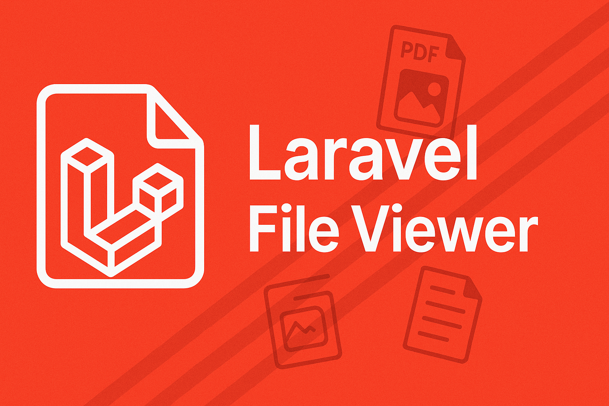

# 🖼️ Laravel File Viewer
[](https://packagist.org/packages/vish4395/laravel-file-viewer)
[](https://packagist.org/packages/vish4395/laravel-file-viewer)

[](https://github.com/vish4395/laravel-file-viewer/stargazers)
[](https://twitter.com/intent/tweet?text=Checkout%20this%20awesome%20package%0Ahttps%3A//github.com/vish4395/laravel-file-viewer/)

<p align="center">

</p>

**Laravel File Viewer** is the easiest way to preview images, videos, audio, PDF, DOCX, PPTX, XLSX, CSV, and more in your Laravel app. Instantly add beautiful file previews to your admin panels, dashboards, or user portals — with zero configuration required.

---

> **✨ Loved by developers. Easy to install. Works out of the box.**

---

## 🚦 Features

- 📄 Preview images, videos, audio, PDF, DOCX, PPTX, XLSX, CSV, plain text, JSON, and archives
- ⚡️ Super simple integration — one method call in your controller
- 🎨 Customizable UI — publish and tweak the views
- 🛡️ Secure: validates file existence via Laravel's storage disks; DOCX frame route uses signed URLs
- 🔧 Configurable toolbar (download, open in new tab, copy link, fullscreen)
- 🌍 Multilingual ready
- 🔌 Auto-discovered — no manual registration required in Laravel 11+

---

## 📋 Requirements

- PHP 8.2+
- Laravel 11, 12, or 13

---

## 🛠️ Installation

Install via Composer:

```bash
composer require vish4395/laravel-file-viewer
```

Publish the assets (required):

```bash
php artisan vendor:publish --provider="Vish4395\LaravelFileViewer\LaravelFileViewerServiceProvider" --tag=assets
```

Publish the config (optional):

```bash
php artisan vendor:publish --provider="Vish4395\LaravelFileViewer\LaravelFileViewerServiceProvider" --tag=config
```

Publish views for UI customization (optional):

```bash
php artisan vendor:publish --provider="Vish4395\LaravelFileViewer\LaravelFileViewerServiceProvider" --tag=views
```

---

## 🚀 Quick Start

The package is auto-discovered in Laravel 11+. No manual provider or alias registration needed.

### Example Controller

```php
use Vish4395\LaravelFileViewer\LaravelFileViewer;

class FilePreviewController extends Controller
{
    public function show(string $fileName)
    {
        return LaravelFileViewer::show(
            fileName: $fileName,
            filePath: $fileName,
            fileUrl: asset('storage/' . $fileName),
            disk: 'public',
            fileData: [
                ['label' => 'Uploaded by', 'value' => 'Jane Doe'],
                ['label' => 'Department',  'value' => 'Finance'],
            ]
        );
    }
}
```

Add a route in `routes/web.php`:

```php
Route::get('/files/{fileName}', [FilePreviewController::class, 'show']);
```

### `LaravelFileViewer::show()` Parameters

| Parameter  | Type          | Default    | Description                                      |
|------------|---------------|------------|--------------------------------------------------|
| `fileName` | `string`      | —          | Display name for the file                        |
| `filePath` | `string`      | —          | Path relative to the storage disk                |
| `fileUrl`  | `string`      | —          | Public URL used to render the preview            |
| `disk`     | `string\|null` | `'public'` | Laravel storage disk (overrides config default)  |
| `fileData` | `array`       | `[]`       | Key/value pairs displayed in the details panel   |

---

## ⚙️ Configuration

After publishing the config (`config/laravel-file-viewer.php`), you can customize behavior via environment variables or directly in the config file.

```php
return [
    // Default storage disk used when no disk is passed to ::show()
    'default_disk' => env('FILE_VIEWER_DISK', 'public'),

    // Fall back to Google Docs Viewer for unsupported file types
    'google_viewer_fallback' => env('FILE_VIEWER_GOOGLE_FALLBACK', false),

    // Toolbar button visibility
    'toolbar' => [
        'download'        => env('FILE_VIEWER_TOOLBAR_DOWNLOAD', true),
        'open_in_new_tab' => env('FILE_VIEWER_TOOLBAR_NEW_TAB', true),
        'copy_link'       => env('FILE_VIEWER_TOOLBAR_COPY_LINK', true),
        'fullscreen'      => env('FILE_VIEWER_TOOLBAR_FULLSCREEN', true),
    ],
];
```

### Environment Variables

| Variable                        | Default  | Description                              |
|---------------------------------|----------|------------------------------------------|
| `FILE_VIEWER_DISK`              | `public` | Default storage disk                     |
| `FILE_VIEWER_GOOGLE_FALLBACK`   | `false`  | Use Google Docs Viewer as fallback       |
| `FILE_VIEWER_TOOLBAR_DOWNLOAD`  | `true`   | Show download button                     |
| `FILE_VIEWER_TOOLBAR_NEW_TAB`   | `true`   | Show "open in new tab" button            |
| `FILE_VIEWER_TOOLBAR_COPY_LINK` | `true`   | Show copy link button                    |
| `FILE_VIEWER_TOOLBAR_FULLSCREEN`| `true`   | Show fullscreen button                   |

---

## 📂 Supported File Types

| Category   | Types                                        | Viewer                  |
|------------|----------------------------------------------|-------------------------|
| Images     | JPEG, PNG, GIF, WebP, SVG, etc.              | Native ``          |
| Video      | MP4, WebM, OGG, etc.                         | Native `<video>`        |
| Audio      | MP3, WAV, OGG, etc.                          | Native `<audio>`        |
| PDF        | `.pdf`                                       | Embedded PDF viewer     |
| Word       | `.docx`, `.doc`                              | docx-preview.js         |
| Excel      | `.xlsx`, `.xls`                              | SheetJS                 |
| PowerPoint | `.pptx`, `.ppt`                              | Office Online / iframe  |
| ODF Text   | `.odt`                                       | WebODF (self-hosted)    |
| ODF Sheet  | `.ods`                                       | WebODF (self-hosted)    |
| ODF Pres.  | `.odp`                                       | WebODF (self-hosted)    |
| CSV        | `.csv`                                       | Inline table            |
| Text       | `.txt`, `.log`, `.md`, `.json`               | Syntax-highlighted text |
| Archives   | `.zip`, `.rar`, `.tar`, `.gz`                | Details panel           |
| Other      | Any unsupported type                         | Office Online or Google Docs Viewer (if enabled) |

---

## 🌟 Why Laravel File Viewer?

- **Save hours**: No need to wire up multiple JS libraries yourself.
- **Modern UI**: Looks great out of the box with a consistent toolbar.
- **Flexible**: Works with any Laravel storage disk — local, S3, or custom.
- **Trusted**: Used in production by agencies and startups.

---

## 📈 Help Us Grow!

If you find this package useful:

- ⭐ Star this repo on GitHub
- 📦 Try it in your next Laravel project
- 🐦 Tweet about it [@vish4395](https://twitter.com/vish4395)
- 💬 Share feedback and suggestions

---

## 📋 Changelog

See [CHANGELOG](CHANGELOG.md) for recent updates.

---

## 🤝 Contributing

PRs are welcome!
See [CONTRIBUTING](CONTRIBUTING.md) for details.
Questions? Email [vishal@newai.in](mailto:vishal@newai.in) or open an issue.

---

## 🔒 Security

If you discover any security issues, please email [vishal@newai.in](mailto:vishal@newai.in) instead of using the issue tracker.

---

## 👏 Credits

- [Vishal Sharma](https://github.com/vish4395)
- [VolodymyrBaydalka/docxjs](https://github.com/VolodymyrBaydalka/docxjs)
- [SheetJS](https://sheetjs.com)
- [WebODF / KO GmbH](https://github.com/kogmbh/WebODF) — AGPL-3.0, bundled via [ViewerJS](https://viewerjs.org/)
- [All Contributors](../../contributors)

---

## 📄 License

MIT. See [License File](LICENSE.md) for details.

---

## 🎬 Demo

https://user-images.githubusercontent.com/12929023/210215225-000507cf-d8f4-4e5b-b7ad-ad6a2276ac93.mp4

---

## ⭐ Star History

[](https://www.star-history.com/#vish4395/laravel-file-viewer&Timeline)

---
